# Documentación de la interfaz — Estirón

App Android de una cadena de tiendas de ropa y calzado infantil de 0 a 14 años, con prototipo de alta fidelidad en Figma siguiendo Material Design 3.
Autor: Sergio Mitchell Bocero ([@sergiomitbo](https://github.com/sergiomitbo)), 2.º DAM, MEDAC.

## 1. Justificación del diseño

### 1.1 Importancia del diseño centrado en el usuario

En Estirón casi nunca compra quien va a llevar la ropa. Compra una madre con el bebé en brazos, un padre a la salida del colegio o un abuelo que solo sabe la edad de su nieta. Los tres tienen poco tiempo, usan el móvil con una mano y dudan con las tallas. Si la app se diseña a partir del catálogo y no de estas personas, el resultado es previsible: compras que se quedan a medias y devoluciones porque la talla no era la buena. Y si alguien elige mal la talla, el fallo no es suyo: la mayoría de los errores de uso son errores de diseño (Norman, 2013).

Por eso el proyecto sigue el ciclo de diseño centrado en el usuario de la norma ISO 9241-210 (International Organization for Standardization [ISO], 2019): entender quién compra y en qué situación (sección 2), diseñar a partir de lo aprendido (sección 3), validar el diseño (sección 4) y corregirlo con lo que salga de las pruebas (apartado 4.3). La regla que aplico es que cada decisión de la interfaz tiene que poder justificarse con un objetivo o con un insight de este documento. Si no se puede, sobra.

### 1.2 Objetivos y metas del proyecto

Cada objetivo tiene un indicador y una meta. Tres se comprueban en las pruebas con usuarios (sección 4) y el cuarto en la guía de estilo (apartado 3.3).

| Objetivo | Indicador | Meta | Dónde se mide |
|---|---|---|---|
| **O1. Comprar rápido**, con el móvil en una mano. | Tiempo desde Inicio hasta Confirmación. | 120 s o menos en cada participante. | Pruebas, tarea T1 |
| **O2. Acertar la talla a la primera**, sin conocerla de antemano. | Participantes que eligen la talla correcta sin ayuda. | 100 %. | Pruebas, tarea T2 |
| **O3. Equivocarse sin consecuencias.** | Participantes que recuperan con «Deshacer» un producto eliminado, y tiempo que tardan. | 100 %, en 10 s o menos. | Pruebas, tarea T3 |
| **O4. Que se lea y se toque bien a cualquier edad.** | Parejas color/on-color con contraste de 4,5:1 o más, y elementos interactivos con área táctil de 48 × 48 dp o más. | 100 % en ambos casos. | Guía de estilo (3.3) y revisión en Figma |

### 1.3 Beneficios esperados

| Para quien compra | Para la cadena |
|---|---|
| Compra completa en un par de minutos y con una sola mano. | Más pedidos terminados y menos carritos abandonados. |
| Talla elegida por edad y altura, con la guía a un toque. | Menos devoluciones por talla, que cuestan envíos, gestión y, a veces, el cliente. |
| Cambio gratis en cualquier tienda y opción de recoger el pedido en tienda. | Más visitas a las tiendas físicas, donde el cliente puede comprar algo más. |
| Favoritos para decidir más tarde o guardar ideas de regalo. | Saber qué productos interesan y dar motivos para volver a la app. |
| Letra legible, buen contraste y compra sin registrarse. | Llegar también a abuelos y compradores de regalos que hoy solo compran en tienda. |

Tras el lanzamiento, estos beneficios se seguirían con tres indicadores: tasa de conversión de la app, porcentaje de devoluciones con motivo «talla» y número de pedidos con recogida en tienda.

## 2. Investigación y análisis de usuarios

### 2.1 Datos demográficos y segmentación

La investigación es básica y parte de tres fuentes: el encargo de la cadena (quién compra y en qué contexto), el análisis de tres apps de la competencia (apartado 2.3) y las dos personas construidas a partir de ambos (apartado 2.2). Divido a quien compra en tres segmentos según su relación con el niño, porque eso cambia cuánto sabe de tallas y con qué frecuencia compra.

| Segmento | Edad aprox. | Frecuencia de compra | Contexto de uso | Lo que más necesita |
|---|---|---|---|---|
| Madres y padres | 28-45 | Alta: los niños cambian de talla varias veces al año, y a eso se suman las temporadas y la vuelta al cole. | Ratos sueltos y con interrupciones, a menudo con el niño en brazos o empujando la sillita. | Reponer rápido, tallas fiables y no perder la compra si les interrumpen. |
| Abuelas y abuelos | 60-75 | Media-baja, concentrada en cumpleaños, Navidad y Reyes. | En casa y sin prisa, pero con poca confianza al pagar con el móvil y con la letra del sistema aumentada. | Entender la talla sin conocerla, textos legibles y un pago claro. |
| Familiares y amigos que regalan | 25-55 | Puntual: nacimientos, bautizos y cumpleaños. | Compra rápida, muchas veces sin conocer bien al niño. | Ideas por edad, ticket regalo y cambio fácil. |

Los tres segmentos comparten tres rasgos que condicionan todo el diseño. Compran desde el móvil, y la app sale solo para Android. Lo usan a menudo con una sola mano: casi la mitad de la gente sujeta el móvil así (Hoober, 2013), y este público suele tener además la otra mano ocupada con el niño. Y ninguno es experto en tallas infantiles, que dependen más de la altura del niño que de su edad. Además, la cadena tiene tiendas físicas, así que la recogida y el cambio en tienda son una ventaja que una tienda solo online no puede ofrecer.

### 2.2 Personas

#### Persona 1: Laura Sánchez, la madre que repone sobre la marcha

| Campo | Detalle |
|---|---|
| **Edad y ocupación** | 34 años. Enfermera con turnos rotativos en un hospital de Getafe. |
| **Familia** | Dos hijos: Leo, de 4 años y 108 cm, y Martina, de 9 meses. |
| **Dispositivo y contexto** | Android de gama media. Compra en el autobús o mientras da el biberón, con una mano libre, y la interrumpen constantemente. |
| **Objetivos** | Reponer pijamas, bodies y zapatillas en pocos minutos; acertar la talla de Leo, que está dando el estirón; recoger el pedido en la tienda de su barrio al salir del turno. |
| **Frustraciones** | Formularios largos en el móvil, botones pequeños que toca sin querer, perder el carrito cuando tiene que dejar el móvil y que cada marca talle distinto, lo que la obliga a devolver. |
| **Frase** | «Si no lo compro en dos minutos, ya no lo compro.» |

#### Persona 2: Antonio Ruiz, el abuelo que quiere acertar con el regalo

| Campo | Detalle |
|---|---|
| **Edad y ocupación** | 68 años. Jubilado; trabajó como administrativo en una gestoría de Zaragoza. |
| **Familia** | Su nieta Lucía vive en Sevilla y cumple 6 años el mes que viene. La ve pocas veces al año. |
| **Dispositivo y contexto** | Android con el tamaño de letra aumentado. Compra desde el sofá y sin prisa, pero desconfía de pagar con el móvil. |
| **Objetivos** | Regalarle a Lucía un vestido que le quede bien sin preguntar a su hija, para que sea sorpresa; enviarlo directamente a Sevilla con ticket regalo; saber que se puede cambiar. |
| **Frustraciones** | Letra pequeña e iconos sin texto; no entender qué significa «116» o «6A»; mensajes de error que no explican qué ha hecho mal; apps que le obligan a registrarse para comprar una sola vez. |
| **Frase** | «Sé que cumple seis años, pero ¿eso qué talla es?» |

### 2.3 Análisis de la competencia

Revisé las apps Android de tres cadenas que venden ropa infantil en España con el mismo recorrido en todas: entrar en la sección infantil, buscar un pijama de 4 años y llegar al carrito.

| App | Qué hace bien | Qué hace mal | Qué me llevo a Estirón |
|---|---|---|---|
| **H&M** | Indica las tallas infantiles por altura en centímetros junto a la edad orientativa, que es más fiable que la edad sola. Filtra por talla, color y precio, y cada tarjeta tiene su corazón de favoritos. | Algunas prendas usan tallas dobles (por ejemplo, 110/116) que obligan a abrir la tabla para entenderlas, y la sección infantil es tan grande que sin filtros cuesta encontrar algo. | Edad y altura en cada opción del selector de talla, sin tallas dobles, y filtros visibles desde el principio. |
| **Zara** | Separa la sección infantil por franjas de edad y por sexo desde el primer nivel, así que en dos toques se llega a la sección correcta. Fotografía grande y limpia, y al elegir talla avisa si quedan pocas unidades. | Estética muy minimalista, con textos pequeños y finos y poco contraste en algunos elementos, lo que complica la lectura a personas mayores. | Categorías por edad en Inicio y el estado del stock dentro del propio selector de talla, pero con textos de 14 sp o más y contraste AA. |
| **Kiabi** | Precios muy visibles, lotes de básicos (bodies, calcetines) y recogida gratuita en tienda. | La pantalla de inicio acumula banners y promociones que compiten entre sí por la atención. | La recogida y el cambio en tienda como ventaja principal, porque Estirón tiene tiendas físicas, y un Inicio con una sola zona de novedades. |

### 2.4 Insights y hallazgos clave

Cada insight sale de la investigación anterior y acaba en una decisión concreta que se puede ver en el prototipo.

| # | Insight | Origen | Decisión de diseño | Pantalla |
|---|---|---|---|---|
| I1 | La edad no basta para acertar la talla: Leo tiene 4 años pero mide 108 cm, más que la talla de 4 años (104 cm). | Encargo, Persona 1, H&M | Selector de talla propio (SelectorTalla) con edad y altura en cada opción, y botón «Guía de tallas» junto a él que abre un bottom sheet con la altura que cubre cada talla. | Detalle |
| I2 | Se compra con una mano y con interrupciones. | Encargo, Persona 1, Hoober (2013) | Acciones principales en la mitad inferior de la pantalla (navigation bar y botón principal fijo abajo), áreas táctiles de 48 × 48 dp como mínimo y un carrito que se conserva al salir de la app. | Todas |
| I3 | Con una mano se toca sin querer, y un diálogo de confirmación castiga a quien sí quería borrar. | Persona 1 | Eliminar del carrito al momento y ofrecer «Deshacer» en un snackbar. | Carrito |
| I4 | Quien regala no conoce la talla y teme equivocarse. | Persona 2, Kiabi | «Cambio gratis en cualquier tienda» visible en Detalle y Confirmación; en Checkout, envío a cualquier dirección, recogida en tienda y ticket regalo. | Detalle, Checkout, Confirmación |
| I5 | Las personas mayores abandonan ante letra pequeña, iconos sin texto y errores que no explican nada. | Persona 2, Zara | Texto de contenido de 14 sp o más (16 sp en formularios), etiquetas siempre visibles en la navigation bar, contraste AA y errores que dicen cómo corregirse, por ejemplo «Escribe el código postal completo (5 cifras)». | Todas, Checkout |
| I6 | Hay poco tiempo y nadie quiere registrarse para una compra puntual. | Personas 1 y 2 | Categorías por edad en Inicio que llevan al catálogo ya filtrado, y compra como invitado en una sola pantalla de checkout. | Inicio, Catálogo, Checkout |

## 3. Diseño de la interfaz

### 3.1 Mapa de navegación

La navigation bar tiene tres destinos: Inicio, Catálogo y Favoritos. El carrito no ocupa un hueco en ella porque se visita al final de la compra y no durante; está siempre a mano en el icono de la top app bar, con un badge que indica cuántos artículos hay. Al pulsar «Añadir al carrito», la app lleva directamente al carrito, porque Laura y Antonio suelen comprar una o dos prendas y así se ahorran un paso (O1); desde allí, «Seguir comprando» devuelve al catálogo. Detalle, Carrito, Checkout y Confirmación ocultan la navigation bar para dejar sitio a un único botón principal abajo: en cada pantalla tiene que ser evidente qué hacer sin pararse a pensar (Krug, 2014).

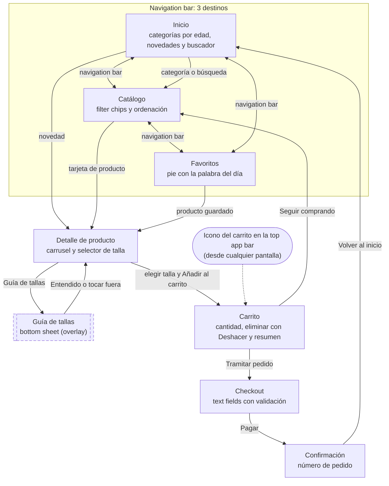

De Inicio a Confirmación hay seis toques si no hay que corregir ningún dato: categoría, producto, talla, «Añadir al carrito», «Tramitar pedido» y «Pagar».

### 3.2 Wireframes

Siete wireframes de baja fidelidad en escala de grises, en frames de 360 × 800 dp, hechos en la página «Wireframes» de Figma (versión guardada: «Reto 2 – wireframes»). En esta fase solo decidí estructura y jerarquía: qué hay en cada pantalla, en qué orden y qué queda al alcance del pulgar.

<table>
  <tr>
    <td align="center">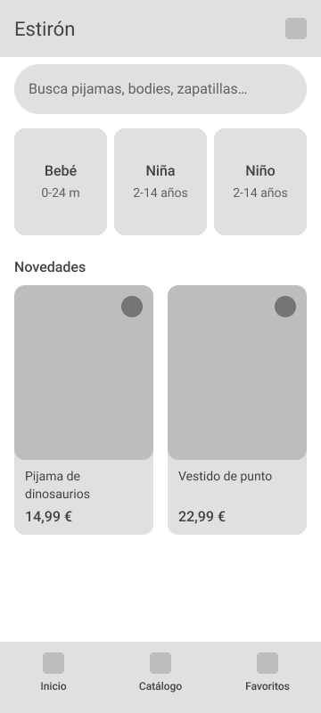 Inicio</td>
    <td align="center">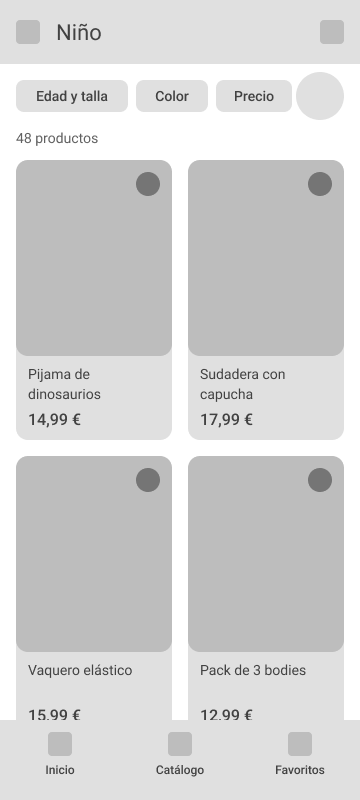 Catálogo</td>
    <td align="center">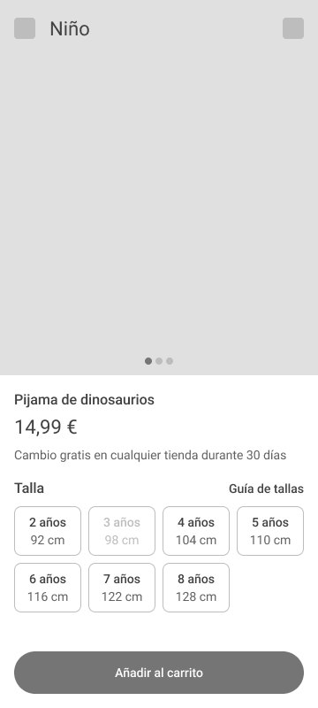 Detalle</td>
    <td align="center">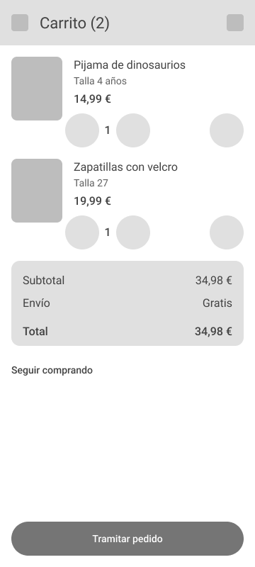 Carrito</td>
  </tr>
  <tr>
    <td align="center">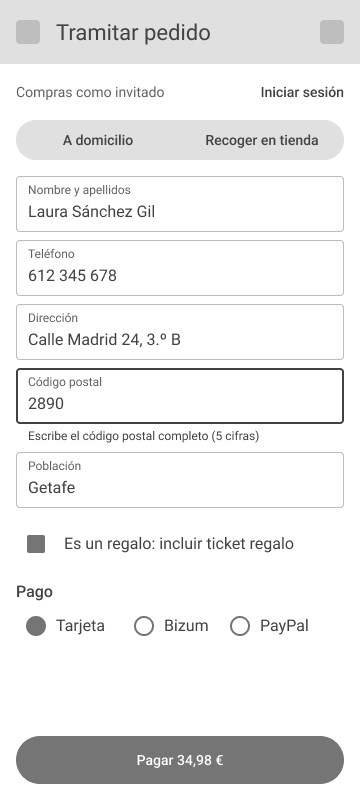 Checkout</td>
    <td align="center">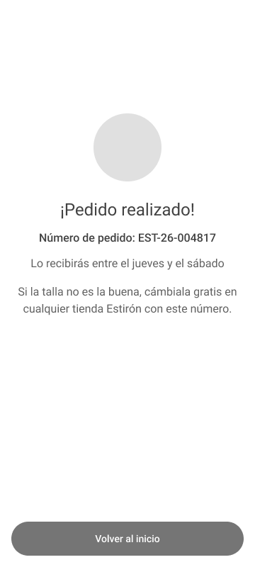 Confirmación</td>
    <td align="center">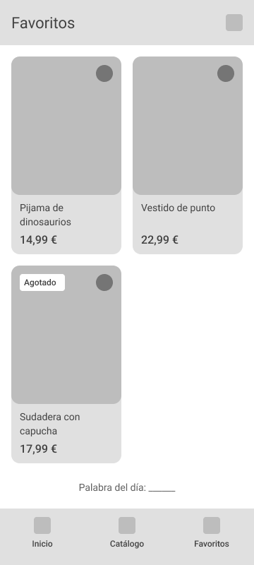 Favoritos</td>
    <td></td>
  </tr>
</table>

| Pantalla | Qué fija el wireframe |
|---|---|
| Inicio | Buscador arriba, tres tarjetas grandes de categoría por edad y un carrusel horizontal de novedades. |
| Catálogo | Fila de filter chips (edad y talla, color, precio) y botón de ordenar sobre una cuadrícula de dos columnas. |
| Detalle | Carrusel de fotos, precio, selector de talla en dos filas con «Guía de tallas» al lado y botón «Añadir al carrito» fijo abajo. |
| Carrito | Lista con selector de cantidad y botón de eliminar, resumen del importe y botón «Tramitar pedido» fijo abajo. |
| Checkout | Tipo de entrega, formulario corto, ticket regalo, método de pago y botón «Pagar». |
| Confirmación | Mensaje de éxito, número de pedido, recordatorio del cambio en tienda y botón «Volver al inicio». |
| Favoritos | Cuadrícula de productos guardados y pie con la palabra del día. |

### 3.3 Guía de estilo Material Design 3

Los valores exactos están en [diseno/estilos.json](diseno/estilos.json); este apartado explica por qué son esos.

#### Color

Color semilla: **#2A9D8F**, un verde azulado. Lo elegí por tres motivos. No asocia la marca a niña o a niño, así que las dos secciones conviven sin recurrir al rosa y al azul. Está lejos del rojo que Material reserva para los errores, de modo que un botón principal nunca se confunde con un aviso en el carrito o en el checkout. Y transmite calma, algo útil justo cuando hay que pagar. A partir de la semilla, Material Theme Builder genera los esquemas claro y oscuro, que están aplicados a los componentes del kit en Figma.

#### Contraste

Ratios calculados con la fórmula de luminancia relativa de WCAG 2.2 (World Wide Web Consortium [W3C], 2023) y truncados a dos decimales, de modo que nunca se redondean hacia arriba. El mínimo exigido es 4,5:1, el nivel AA para texto normal.

| Pareja | Claro | Ratio | Oscuro | Ratio | ¿≥ 4,5:1? |
|---|---|---|---|---|---|
| primary / onPrimary | `#006A60` / `#FFFFFF` | 6,50:1 | `#82D5C8` / `#003731` | 7,73:1 | Sí |
| primaryContainer / onPrimaryContainer | `#9EF2E4` / `#005048` | 7,26:1 | `#005048` / `#9EF2E4` | 7,26:1 | Sí |
| secondary / onSecondary | `#4A635F` / `#FFFFFF` | 6,47:1 | `#B1CCC6` / `#1C3531` | 7,68:1 | Sí |
| tertiary / onTertiary | `#456179` / `#FFFFFF` | 6,48:1 | `#ADCAE6` / `#153349` | 7,72:1 | Sí |
| surface / onSurface | `#F4FBF8` / `#161D1B` | 16,31:1 | `#0E1513` / `#DDE4E1` | 14,32:1 | Sí |
| error / onError | `#BA1A1A` / `#FFFFFF` | 6,46:1 | `#FFB4AB` / `#690005` | 7,71:1 | Sí |

Además de las doce claves del JSON, el prototipo usa estas parejas, que también cumplen:

| Pareja | Dónde se usa | Ratio claro | Ratio oscuro | Mínimo | ¿Cumple? |
|---|---|---|---|---|---|
| secondaryContainer / onSecondaryContainer | Indicador activo de la navigation bar y filter chips seleccionados | 7,24:1 | 7,24:1 | 4,5:1 | Sí |
| surfaceContainer / onSurfaceVariant | Iconos y etiquetas inactivos de la navigation bar | 7,99:1 | 9,64:1 | 4,5:1 | Sí |
| surface / onSurfaceVariant | Texto de ayuda de los campos y textos secundarios | 8,86:1 | 10,88:1 | 4,5:1 | Sí |
| inverseSurface / inverseOnSurface | Texto del snackbar | 11,55:1 | 10,15:1 | 4,5:1 | Sí |
| inverseSurface / inversePrimary | Acción «Deshacer» del snackbar | 7,68:1 | 5,03:1 | 4,5:1 | Sí |
| surface / outline | Borde del SelectorTalla y de los text fields (componente: mínimo 3:1) | 4,27:1 | 5,84:1 | 3:1 | Sí |

La variante «sin stock» del SelectorTalla usa texto atenuado al 38 %, como cualquier estado deshabilitado de Material. WCAG no exige contraste mínimo a los componentes inactivos, pero la talla agotada aparece además tachada para que el estado no dependa solo del color.

#### Tipografía

Roboto con la escala tipográfica de Material 3 (Google, s. f.), que es además la familia del propio Android. Los tamaños van en sp para que respeten el tamaño de letra que cada persona configura en su móvil, algo importante para usuarios como Antonio. El texto de contenido nunca baja de 14 sp; solo las etiquetas de la navigation bar usan 12 sp, como indica Material.

| Rol | Tamaño / interlineado (sp) | Peso | Uso en Estirón |
|---|---|---|---|
| headlineSmall | 24 / 32 | 400 | Título de Confirmación («¡Pedido realizado!»). |
| titleLarge | 22 / 28 | 400 | Títulos de la top app bar y precio en Detalle. |
| titleMedium | 16 / 24 | 500 | Nombre del producto en Detalle, títulos de sección y precio en las tarjetas. |
| bodyLarge | 16 / 24 | 400 | Texto principal y texto que se escribe en los campos del formulario. |
| bodyMedium | 14 / 20 | 400 | Nombre del producto en las tarjetas, altura en el SelectorTalla y textos de apoyo. |
| labelLarge | 14 / 20 | 500 | Botones, chips y talla en el SelectorTalla. |
| labelMedium | 12 / 16 | 500 | Etiquetas de la navigation bar. |

#### Rejilla, espaciado y áreas táctiles

Las pantallas miden 360 × 800 dp, la clase de ventana compacta de Android. La rejilla tiene 4 columnas con márgenes de 16 dp y medianiles de 16 dp, lo que deja columnas de 70 dp: cada tarjeta del catálogo ocupa dos columnas (156 dp). Todos los espaciados son múltiplos de 8 dp (8, 16, 24 y 32).

Ningún elemento interactivo tiene menos de 48 × 48 dp de área táctil. Los icon buttons miden 48 × 48 dp, los chips se colocan en una fila de 48 dp de alto, cada opción del SelectorTalla mide 76 × 56 dp (caben cuatro por fila con 8 dp entre ellas) y los botones principales ocupan todo el ancho útil, 328 dp. La top app bar mide 64 dp y la navigation bar 80 dp.

#### Forma, iconos y componentes

Se sigue la escala de forma de Material 3: tarjetas con esquinas de 12 dp, chips y SelectorTalla de 8 dp, botones completamente redondeados y bottom sheet con 28 dp en las esquinas superiores. Los iconos son los Material Symbols del kit, y en la navigation bar siempre van con su etiqueta de texto.

Componentes del kit Material 3: top app bar, navigation bar, search bar, card, filter chip, button (filled y text), icon button, text field (outlined), segmented button, checkbox, radio button, snackbar y bottom sheet. Componentes propios, con auto layout y variantes: **TarjetaProducto** (normal, favorito, agotado) y **SelectorTalla** (disponible, seleccionada, sin stock).

### 3.4 Prototipo de alta fidelidad

Prototipo navegable: [abrir en Figma](https://www.figma.com/proto/kA36uNU9arEZQTECRfAs6X/T1-%C2%B7-Estir%C3%B3n-%C2%B7-Sergio-Mitchell-Bocero?node-id=60812-38379&starting-point-node-id=60812%3A38379). Versión guardada: «Reto 4 – alta fidelidad».

<table>
  <tr>
    <td align="center">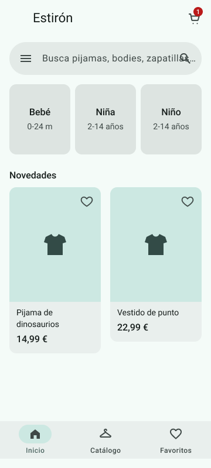 Inicio</td>
    <td align="center">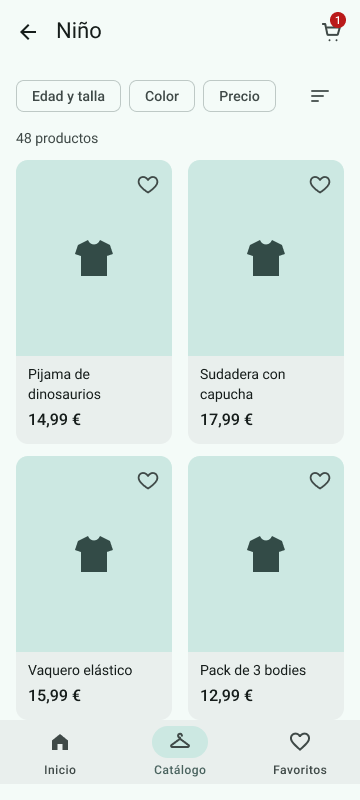 Catálogo</td>
    <td align="center"> Detalle</td>
    <td align="center">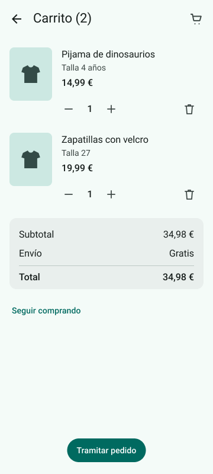 Carrito</td>
  </tr>
  <tr>
    <td align="center">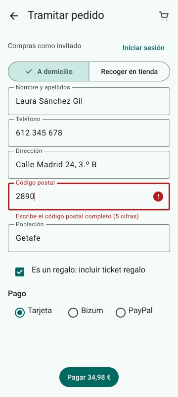 Checkout (error)</td>
    <td align="center">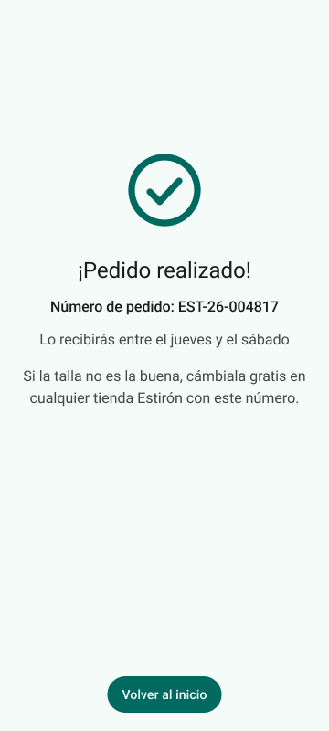 Confirmación</td>
    <td align="center">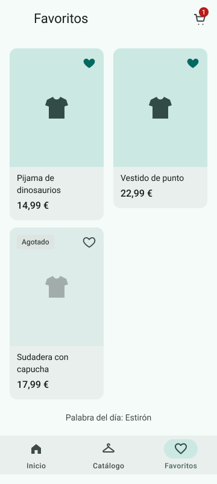 Favoritos</td>
    <td align="center">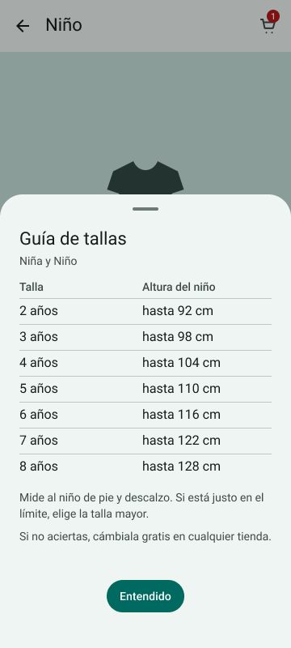 Guía de tallas</td>
  </tr>
  <tr>
    <td align="center">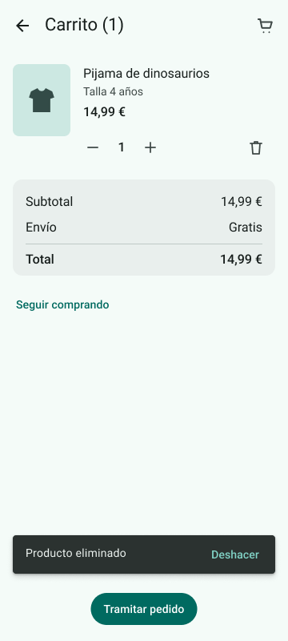 Snackbar «Deshacer»</td>
    <td align="center">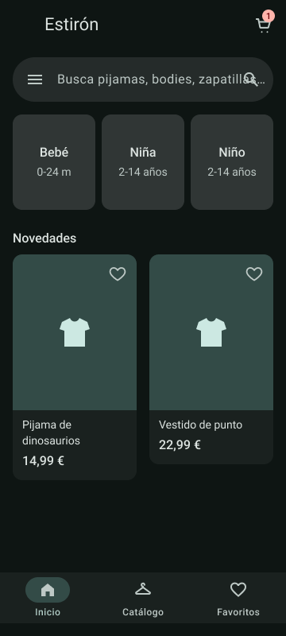 Inicio (oscuro)</td>
    <td align="center">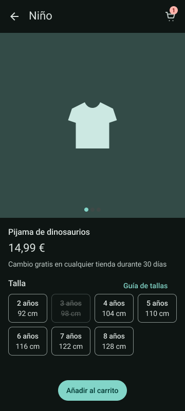 Detalle (oscuro)</td>
    <td></td>
  </tr>
</table>

| Pantalla | Componentes | Qué resuelve |
|---|---|---|
| Inicio | Top app bar, search bar, tres tarjetas de categoría (Bebé 0-24 m, Niña y Niño), carrusel de TarjetaProducto y navigation bar. | Llegar en un toque a la sección de edad correcta (I6). |
| Catálogo | Top app bar, filter chips (edad y talla, color, precio), botón de ordenar, cuadrícula de TarjetaProducto y navigation bar. | Reducir un catálogo grande a lo que le sirve a ese niño. |
| Detalle | Top app bar, carrusel de fotos, SelectorTalla, text button «Guía de tallas», bottom sheet y filled button «Añadir al carrito». | Elegir la talla con seguridad (I1, I4). |
| Carrito | Top app bar, lista con selector de cantidad e icon button de eliminar, snackbar, resumen del importe y filled button «Tramitar pedido». | Revisar y corregir sin miedo (I3). |
| Checkout | Top app bar, segmented button (a domicilio o recoger en tienda), text fields, checkbox de ticket regalo, radio buttons de pago y filled button «Pagar». | Pagar sin registrarse y con errores que se entienden (I4, I5, I6). |
| Confirmación | Icono de éxito, número de pedido, recordatorio del cambio en tienda y filled button «Volver al inicio». | Cerrar la compra con tranquilidad. |
| Favoritos | Top app bar, cuadrícula de TarjetaProducto (favorito y agotado), pie con la palabra del día y navigation bar. | Guardar ideas para decidir después. |

| Requisito | Cómo está resuelto |
|---|---|
| Flujo de compra | Inicio → Catálogo → Detalle → elegir talla → Carrito → Checkout → Confirmación → Inicio. El flujo empieza en Inicio. |
| Navigation bar | Inicio, Catálogo y Favoritos están enlazados entre sí desde las tres pantallas. |
| Overlay | «Guía de tallas» abre un bottom sheet como overlay anclado abajo, con el fondo oscurecido y cierre al tocar fuera o en «Entendido». |
| Smart Animate | Al tocar una talla, el SelectorTalla pasa de «disponible» a «seleccionada» (componente interactivo). También anima la eliminación en el carrito y la corrección del código postal. |
| Estado de error | El campo «Código postal» aparece en error con el texto de ayuda «Escribe el código postal completo (5 cifras)»; al tocarlo, se muestra corregido y ya se puede pagar. |
| Snackbar | Al eliminar un producto del carrito aparece «Producto eliminado» con la acción «Deshacer», que lo recupera. |
| Modo oscuro | Inicio y Detalle duplicados con el esquema oscuro. |
| Palabra del día | En el pie de Favoritos y al final de este documento. |

## 4. Validación y pruebas

### 4.1 Metodología

En esta entrega la validación se hizo con una evaluación heurística del prototipo navegable, en lugar de pruebas con usuarios. Es un método de inspección en el que se revisa la interfaz contra principios de usabilidad reconocidos (Nielsen y Molich, 1990). Aquí se aplicaron las diez heurísticas de Nielsen pantalla a pantalla y se recorrieron en el prototipo las tres tareas que servirán para las pruebas con usuarios.

| Tarea | Escenario | Empieza en | Recorrido en el prototipo | Objetivo |
|---|---|---|---|---|
| T1 | «Tu hijo tiene 4 años y necesita un pijama. Cómpraselo y termina el pedido.» | Inicio | 6 toques si no hay que corregir datos: Niño, pijama, 4 años, «Añadir al carrito», «Tramitar pedido» y «Pagar». | O1 |
| T2 | «Tu nieta cumple 6 años y mide 120 cm. Elige la talla de este pijama.» | Detalle | 2 toques para abrir y cerrar la guía de tallas y 1 para elegir 7 años (hasta 122 cm). | O2 |
| T3 | «Tienes en el carrito unas zapatillas que no querías. Quítalas. Ahora recupéralas.» | Carrito | 2 toques: la papelera y «Deshacer» en el snackbar. | O3 |

Cada problema se clasifica por severidad, de 0 (no es un problema) a 4 (impide completar la tarea).

### 4.2 Resultados

| # | Heurística | Hallazgo | Pantalla | Severidad |
|---|---|---|---|---|
| H1 | Coincidencia entre el sistema y el mundo real | En el selector, «104 cm» puede leerse como la altura exacta del niño y no como la máxima de esa talla. En T2, con 120 cm, se puede acabar eligiendo 6 años (116 cm) si no se abre la guía. | Detalle | 3 |
| H2 | Prevención de errores | Con el código postal en error, «Pagar» no responde ni dice por qué; el aviso solo aparece junto al campo, que puede quedar fuera de la vista. | Checkout | 2 |
| H3 | Consistencia y estándares | El icono del carrito aparece en la barra superior de Checkout pero ahí no hace nada, cuando en el resto de pantallas abre el carrito. | Checkout | 1 |

Las tres tareas se completan en el prototipo sin callejones sin salida, y la compra de T1 cabe en seis toques, en línea con O1. El problema más grave es H1, porque afecta directamente a O2.

### 4.3 Iteraciones y mejoras

| Hallazgo | Cambio aplicado | Por qué |
|---|---|---|
| H1 | La etiqueta «Talla» pasa a «Talla por altura» y cada opción muestra la altura como máximo («≤104 cm»). | Deja claro que se elige por la altura del niño y que cada talla cubre hasta esa altura, sin obligar a abrir la guía. |

La versión de Figma con este cambio es «Reto 5 – iteración». H2 y H3 quedan para la siguiente iteración (apartado 5.2).

| Antes | Después |
|---|---|
| 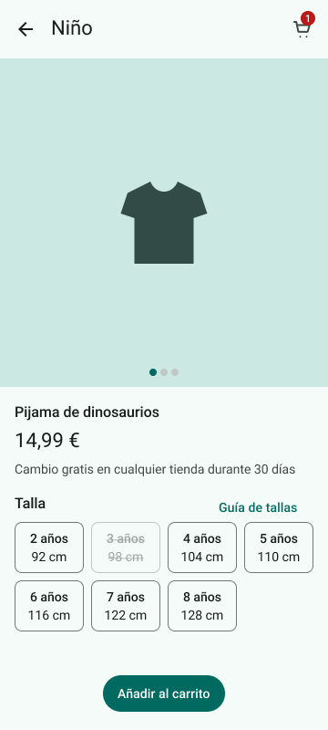 | 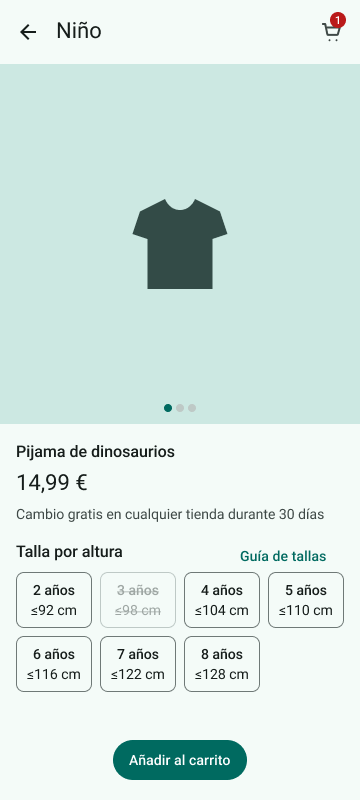 |

## 5. Entrega y documentación final

### 5.1 Justificación del diseño propuesto

El diseño responde a los tres rasgos que definen a quien compra en Estirón. Para el poco tiempo, la compra cabe en seis pantallas y seis toques, las categorías por edad llevan directamente al catálogo filtrado y el checkout no exige registro (O1, I6). Para la duda con las tallas, cada talla muestra edad y altura, la guía está a un toque en un bottom sheet que no saca al usuario del producto y el cambio gratis en tienda sirve de red de seguridad (O2, I1, I4). Para el uso con una mano, las acciones principales están en la mitad inferior, todas las áreas táctiles miden al menos 48 dp y un error se deshace con un toque (O3, O4, I2, I3).

Material Design 3 aporta algo más que estética: son patrones que cualquier usuario de Android ya conoce, como la navigation bar, los chips o el snackbar; sus roles de color están pensados para cumplir el contraste mínimo (comprobado en el apartado 3.3); y el diseño se traslada directamente a código con los componentes de Material 3 para Jetpack Compose.

La evaluación heurística confirmó que las tres tareas se completan sin bloqueos y que la compra cabe en seis toques. Detectó un riesgo en la elección de talla (H1), ya corregido en la iteración, y dos problemas menores en el checkout que quedan para la siguiente versión. Los objetivos O1, O2 y O3 tienen que medirse todavía con usuarios reales.

### 5.2 Recomendaciones y pasos a seguir

| Recomendación | Motivo |
|---|---|
| Probar el prototipo con cinco personas del público real, al menos dos de ellas mayores de 60 años, midiendo éxito, tiempo y errores en T1, T2 y T3. | La evaluación heurística no sustituye a observar a usuarios, y cinco personas bastan para encontrar la mayoría de los problemas (Nielsen, 2000). |
| Corregir H2 y H3: mostrar el error también junto a «Pagar» y quitar el carrito de la barra de Checkout. | Son los dos problemas pendientes de la evaluación. |
| Crear un perfil «Mis peques» con la edad y la altura de cada niño. | Preseleccionar la talla y filtrar el catálogo automáticamente (I1, I6). |
| Mostrar el stock por tienda y permitir reservar para recoger. | Sacar más partido a la red de tiendas (I4). |
| Añadir aviso de reposición en las tallas agotadas. | Ahora la variante «sin stock» es un callejón sin salida. |
| Revisar la accesibilidad en la app real: TalkBack, letra al 200 % y modo oscuro en todas las pantallas. | El prototipo no permite comprobarlo. |
| Diseñar las versiones para pantallas medianas y grandes (tabletas y plegables) con navigation rail. | El prototipo solo cubre la clase compacta. |

## 6. Referencias bibliográficas

Google. (s. f.). *Material Design 3*. https://m3.material.io/

Hoober, S. (2013, 18 de febrero). *How do users really hold mobile devices?* UXmatters. https://www.uxmatters.com/mt/archives/2013/02/how-do-users-really-hold-mobile-devices.php

International Organization for Standardization. (2019). *Ergonomics of human-system interaction — Part 210: Human-centred design for interactive systems* (ISO 9241-210:2019).

Krug, S. (2014). *Don't make me think, revisited: A common sense approach to web usability* (3.ª ed.). New Riders.

Nielsen, J. (2000, 18 de marzo). *Why you only need to test with 5 users*. Nielsen Norman Group. https://www.nngroup.com/articles/why-you-only-need-to-test-with-5-users/

Nielsen, J., y Molich, R. (1990). Heuristic evaluation of user interfaces. En *Proceedings of the SIGCHI Conference on Human Factors in Computing Systems* (pp. 249–256). ACM. https://doi.org/10.1145/97243.97281

Norman, D. A. (2013). *The design of everyday things* (Ed. rev. y ampl.). Basic Books.

World Wide Web Consortium. (2023). *Web Content Accessibility Guidelines (WCAG) 2.2*. https://www.w3.org/TR/WCAG22/

Palabra del día: Estirón
